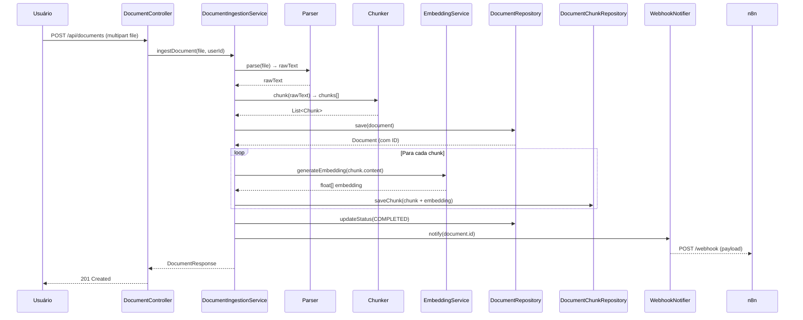
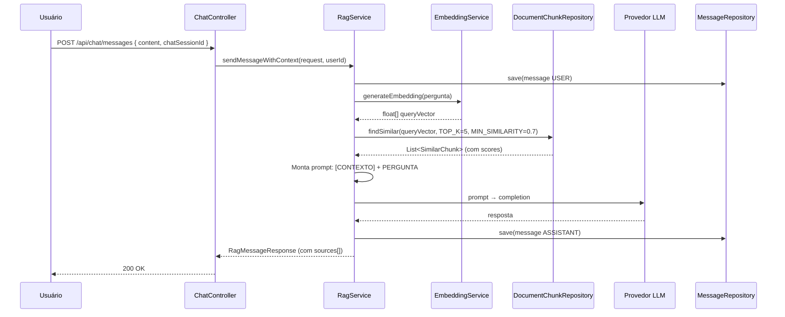

# System Specification — Chat IA (Parte 2)

> **Evolução:** H2 → PostgreSQL + pgvector · Pipeline RAG · Ingestão de Documentos · Integração n8n
> **Stack:** Java 17 · Spring Boot 3.4.x · Spring AI 1.0.x · PostgreSQL 16 + pgvector · Flyway · React
> **Arquitetura:** Clean Architecture (Parte 1 mantida + novos módulos + Spring AI adaptado via ports)

---

## 1. VISÃO GERAL DA EVOLUÇÃO (Parte 1 → Parte 2)

### 1.1 O que muda arquiteturalmente

| Aspecto | Parte 1 | Parte 2 |
|---------|---------|---------|
| **Banco** | H2 (file-based) | PostgreSQL + pgvector |
| **Mensagens** | Apenas USER, sem resposta IA | USER → RAG retrieval → resposta ASSISTANT com fontes |
| **Documentos** | Armazenados como `byte[]` no banco | Pipeline de ingestão (parse → chunk → embed → persistir) |
| **Embeddings** | ✗ | Geração de vetores por chunk via `EmbeddingService` |
| **Busca semântica** | ✗ | `pgvector` cosine similarity com TOP_K e MIN_SIMILARITY |
| **Orquestração** | Serviços síncronos simples | `RagService` como orquestrador puro |
| **Automação** | ✗ | Webhook para n8n após indexação |
| **Frontend** | ✗ | React com componentes de apresentação + hooks |
| **Sources** | ✗ | Respostas RAG incluem metadados das fontes |

### 1.2 Por que RAG é necessário

O sistema precisa responder perguntas baseadas no conteúdo de documentos enviados pelo usuário (arquivos `.txt` e `.pdf`). A abordagem RAG permite:
- **Contexto aumentado**: a pergunta do usuário é enriquecida com chunks semanticamente relevantes
- **Transparência**: as fontes (documento, trecho) são exibidas ao usuário
- **Escalabilidade**: o retrieval é independente do modelo de IA
- **Manutenibilidade**: documentos podem ser reindexados sem afetar o pipeline de geração

### 1.3 Por que migrar de H2 para PostgreSQL + pgvector

- O H2 **não suporta extensão pgvector** nem busca por similaridade vetorial
- pgvector é a extensão padrão para busca semântica em PostgreSQL (suporta cosine, L2, inner product)
- A busca vetorial precisa estar no mesmo banco dos dados relacionais para evitar consistência eventual entre sistemas
- A migração mantém uma única fonte de dados (transações ACID + vetores)

### 1.4 Separação entre ingestão e retrieval

| Pipeline | Responsabilidade | Gatilho |
|----------|-----------------|---------|
| **Ingestão** | Receber documento → extrair texto → chunking → embedding → persistir + disparar webhook | `POST /api/documents` |
| **Retrieval** | Receber pergunta → embedding da query → similaridade vetorial → montar prompt com contexto → responder | `POST /api/chat/messages` (evoluído) |

São dois fluxos independentes. A ingestão é assíncrona (pode ser processada em background). O retrieval é síncrono para o usuário.

---

## 2. ARQUITETURA DO BACKEND

### 2.1 Padrão de integração com Spring AI

A Parte 2 usa **Spring AI** como framework de abstração para comunicação com provedores de IA, mas **sem vazar essa dependência para as camadas internas**. O padrão é:

```
application/port/outbound/
├── EmbeddingProvider.java     ← interface sua (porta de saída)
└── LlmProvider.java           ← interface sua (porta de saída)

infra/ai/
├── SpringAiEmbeddingAdapter.java  ← implementa EmbeddingProvider usando Spring AI EmbeddingModel
└── SpringAiLlmAdapter.java        ← implementa LlmProvider usando Spring AI ChatModel
```

**Vantagens:**
- `application` permanece puro, sem dependência de Spring AI
- Trocando o adaptador em `infra/ai/`, troca-se o provedor sem alterar orquestração
- Spring AI gerencia retry, timeout, parsing, rate limit automaticamente
- OpenRouter usa API compatível com OpenAI → Spring AI `openai-spring-starter` funciona direto

Para o webhook do n8n, usa-se **RestClient** (Spring Boot 3.2+) — cliente HTTP síncrono moderno, sem WebFlux.

### 2.2 Novos serviços e responsabilidades

| Serviço | Camada | Responsabilidade |
|---------|--------|-----------------|
| `DocumentIngestionUseCase` | application.port.inbound | Contrato para pipeline de ingestão de documentos |
| `DocumentIngestionService` | application.service | Orquestra parsing, chunking, embedding e persistência de chunks |
| `EmbeddingUseCase` | application.port.inbound | Contrato para gerar embeddings |
| `EmbeddingService` | application.service | Gera embeddings (agnóstico ao domínio); delega a `EmbeddingProvider` |
| `RagUseCase` | application.port.inbound | Contrato para orquestração RAG |
| `RagService` | application.service | Orquestrador puro: embedding da query → busca vetorial → montagem de prompt → retorno com sources |
| `EmbeddingProvider` | application.port.outbound | Contrato para gerar vetores de embedding (implementado via Spring AI) |
| `LlmProvider` | application.port.outbound | Contrato para gerar respostas via LLM (implementado via Spring AI) |
| `DocumentRepository` | application.port.outbound | Persistência de documentos (metadados) |
| `DocumentChunkRepository` | application.port.outbound | Persistência de chunks + suporte a busca por similaridade vetorial |
| `WebhookNotifier` | application.port.outbound | Dispara notificação assíncrona para n8n após indexação |

### 2.3 Métodos públicos esperados por serviço

**`DocumentIngestionUseCase`:**
```
ingestDocument(file: MultipartFile, userId: UUID): DocumentResponse
getDocumentStatus(documentId: UUID, userId: UUID): DocumentStatusResponse
reprocessDocument(documentId: UUID, userId: UUID): DocumentResponse
```

**`EmbeddingUseCase`:**
```
generateEmbedding(text: String): float[]
generateEmbeddings(texts: List<String>): List<float[]>
```

**`RagUseCase`:**
```
sendMessageWithContext(request: SendMessageRequest, userId: UUID): RagMessageResponse
```

### 2.4 Contratos de entrada e saída de cada serviço

**DocumentIngestionService:**

| Entrada | Saída |
|---------|-------|
| `byte[] fileContent`, `String fileName`, `long fileSize`, `UUID userId` | `DocumentResponse { id, fileName, fileSize, status, chunkCount, createdAt }` |
| `UUID documentId`, `UUID userId` | `DocumentStatusResponse { id, status, progress, errorMessage? }` |

**EmbeddingService:**

| Entrada | Saída |
|---------|-------|
| `String text` | `float[] embeddingVector` (1536 dimensões — text-embedding-3-small) |
| `List<String> texts` | `List<float[]>` |

**RagService:**

| Entrada | Saída |
|---------|-------|
| `UUID chatSessionId`, `String question`, `UUID userId` | `RagMessageResponse { id, chatSessionId, role: "ASSISTANT", content, sources: [Source] }` |

Onde `Source = { documentId, documentName, chunkIndex, excerpt, score }`.

### 2.5 Responsabilidades detalhadas

**Parsing (dentro de DocumentIngestionService)**
- Extrair texto bruto de `.txt` (leitura direta) e `.pdf` (via lib externa — Apache PDFBox ou similar)
- Validar encoding e tamanho máximo por documento (ex: 10MB de texto extraído)
- Delegar o texto limpo ao chunker

**Chunking (dentro de DocumentIngestionService)**
- Dividir o texto em chunks com tamanho e overlap configuráveis
- Parâmetros: `CHUNK_SIZE=1000` caracteres, `CHUNK_OVERLAP=200` caracteres
- Cada chunk preserva metadados: `documentId`, `chunkIndex`, `content`, `metadata` (JSON com página aproximada ou seção)

**Embedding (EmbeddingService → EmbeddingProvider → Spring AI)**
- Recebe texto de cada chunk → delega a `EmbeddingProvider` (porta de saída)
- `EmbeddingProvider` é implementado por `SpringAiEmbeddingAdapter` que usa `EmbeddingModel` do Spring AI
- Provedor real: **OpenRouter** com modelo `text-embedding-3-small` (1536 dimensões)
- Retorna vetor `float[]` de dimensionalidade fixa (configurável via `app.embedding.dimensions`)
- Serviço agnóstico ao domínio do documento — não conhece entidades `Document` ou `Chunk`

**LLM de geração (RagService → LlmProvider → Spring AI)**
- Recebe prompt com contexto + pergunta → delega a `LlmProvider` (porta de saída)
- `LlmProvider` é implementado por `SpringAiLlmAdapter` que usa `ChatModel` do Spring AI
- Provedor real: **OpenRouter** com modelo `meta-llama/llama-4-scout-17b-16e-instruct`
- A interface `LlmProvider` expõe método `generate(prompt: String): String` — sem acoplamento ao Spring AI

**Persistência vetorial (DocumentChunkRepository)**
- Suporta: `saveAll(List<DocumentChunk>)`, `findSimilar(float[] queryVector, int topK, double minSimilarity)`
- A busca usa `<=>` (cosine distance) do pgvector, convertida para similaridade

**Webhook (WebhookNotifier)**
- Executa após todos os chunks de um documento serem persistidos
- Dispara `POST` para URL configurada (`app.n8n.webhook-url`)
- É assíncrono (`@Async` ou `TaskExecutor`) — não bloqueia o fluxo principal

### 2.6 Relação entre serviços, provedores e repositórios

```
DocumentIngestionService (application)
  → Chama EmbeddingService (application)
      → EmbeddingService delega a EmbeddingProvider (porta outbound)
          → SpringAiEmbeddingAdapter (infra/ai) usa EmbeddingModel (Spring AI)
              → OpenRouter /embeddings (text-embedding-3-small)
  → Chama DocumentRepository.save()
  → Chama DocumentChunkRepository.saveAll()
  → Chama WebhookNotifier.notify()
      → N8nWebhookNotifier (adapter/out) usa RestClient

RagService (application)
  → Chama EmbeddingService → EmbeddingProvider → Spring AI → OpenRouter (embedding da query)
  → Chama DocumentChunkRepository.findSimilar()
  → Monta o prompt com contexto + pergunta original
  → Chama LlmProvider (porta outbound)
      → SpringAiLlmAdapter (infra/ai) usa ChatModel (Spring AI)
          → OpenRouter /chat/completions (meta-llama/llama-4-scout-17b-16e-instruct)
  → Chama MessageRepository.save() para persistir mensagem ASSISTANT
  → Retorna RagMessageResponse com sources
```

---

## 3. FLUXOS PRINCIPAIS

### 3.1 Pipeline de ingestão de documentos



### 3.2 Pipeline de perguntas RAG



### 3.3 Explicação passo a passo

**Fluxo de Ingestão:**
1. Usuário faz upload de arquivo via `POST /api/documents`
2. Controller delega ao `DocumentIngestionService`
3. O serviço extrai o texto bruto (parsing TXT ou PDF)
4. O texto é dividido em chunks (tamanho e overlap configuráveis)
5. O documento é salvo no banco com status `PROCESSING`
6. Para cada chunk: gera embedding via `EmbeddingService` e persiste chunk + vetor
7. Status do documento é atualizado para `COMPLETED`
8. Webhook assíncrono notifica o n8n (se configurado)

**Fluxo de Retrieval RAG:**
1. Usuário envia pergunta via `POST /api/chat/messages`
2. Mensagem USER é persistida
3. `RagService` gera embedding da pergunta
4. Busca os top-K chunks mais similares no pgvector (acima de `MIN_SIMILARITY`)
5. Monta prompt com contexto (chunks) + pergunta original
6. Envia prompt ao provedor LLM
7. Resposta ASSISTANT é persistida com referência às sources
8. Retorna resposta + metadados das fontes utilizadas

---

## 4. CONTRATOS DE API

### 4.1 Endpoints existentes (mantidos sem alteração)

| Método | Rota | Descrição | Códigos |
|--------|------|-----------|---------|
| POST | `/api/auth/login` | Login | 200, 401 |
| POST | `/api/auth/register` | Registrar | 201, 400 |
| GET | `/api/chat/sessions` | Listar sessões | 200, 401 |
| POST | `/api/chat/sessions` | Criar sessão | 201, 400, 401 |
| GET | `/api/chat/sessions/{sessionId}/messages` | Histórico | 200, 401, 404 |
| POST | `/api/chat/files` | Upload anexo | 200, 400, 401, 413 |
| GET | `/api/chat/files/{fileId}` | Download anexo | 200, 401, 404 |
| GET | `/api/health` | Health check | 200 |

### 4.2 Endpoints novos da Parte 2

**`POST /api/documents`** — Ingestão de documento para pipeline RAG
- **Request:** `multipart/form-data` com campo `file` (TXT/PDF, máx 5MB)
- **Response:** `201 Created`

```json
{
  "id": "3a1b2c3d-...",
  "fileName": "relatorio.pdf",
  "fileSize": 245760,
  "status": "PROCESSING",
  "chunkCount": 0,
  "createdAt": "2026-06-27T10:00:00Z"
}
```

- **Status codes:**
  - `201` — Documento aceito para processamento
  - `400` — Formato inválido (apenas TXT/PDF)
  - `401` — Não autenticado
  - `413` — Tamanho excedido (máx 5MB)

**`GET /api/documents/{id}`** — Status do documento indexado
- **Response:** `200 OK`

```json
{
  "id": "3a1b2c3d-...",
  "fileName": "relatorio.pdf",
  "fileSize": 245760,
  "status": "COMPLETED",
  "chunkCount": 42,
  "createdAt": "2026-06-27T10:00:00Z",
  "completedAt": "2026-06-27T10:00:05Z",
  "errorMessage": null
}
```

- **Status codes:**
  - `200` — Status retornado
  - `401` — Não autenticado
  - `404` — Documento não encontrado

**`POST /api/documents/{id}/reprocess`** — Reprocessar documento (opcional)
- **Response:** `202 Accepted`

```json
{
  "id": "3a1b2c3d-...",
  "fileName": "relatorio.pdf",
  "fileSize": 245760,
  "status": "PROCESSING",
  "chunkCount": 0,
  "createdAt": "2026-06-27T10:00:00Z"
}
```

- **Status codes:**
  - `202` — Reprocessamento aceito
  - `401` — Não autenticado
  - `404` — Documento não encontrado

### 4.3 Endpoint evoluído: `POST /api/chat/messages`

**Mudança de comportamento da Parte 1 para a Parte 2:**

| Aspecto | Parte 1 | Parte 2 |
|---------|---------|---------|
| Response | `MessageResponse` simples | `RagMessageResponse` com `sources[]` |
| Role | Apenas USER salva | USER salva + ASSISTANT gerado via RAG |
| Conteúdo | Apenas echo da mensagem | Resposta gerada com base em contexto dos documentos |

**Request (inalterado):**

```json
{
  "chatSessionId": "uuid",
  "content": "Qual foi o faturamento do Q3?"
}
```

**Response da Parte 2:**

```json
{
  "id": "uuid",
  "chatSessionId": "uuid",
  "role": "ASSISTANT",
  "content": "Com base no relatório, o faturamento do Q3 foi de R$ 2,3 milhões.",
  "timestamp": "2026-06-27T10:05:00Z",
  "sources": [
    {
      "documentId": "uuid",
      "documentName": "relatorio-q3.pdf",
      "chunkIndex": 5,
      "excerpt": "O faturamento consolidado do terceiro trimestre atingiu R$ 2,3 milhões...",
      "score": 0.92
    },
    {
      "documentId": "uuid",
      "documentName": "relatorio-q3.pdf",
      "chunkIndex": 6,
      "excerpt": "Esse valor representa um crescimento de 15%...",
      "score": 0.85
    }
  ]
}
```

- **Status codes:**
  - `200` — Mensagem processada com resposta RAG
  - `400` — Dados inválidos (conteúdo vazio ou > 10.000 caracteres)
  - `401` — Não autenticado
  - `404` — Sessão não encontrada
  - `503` — Provedor de embedding ou LLM indisponível

### 4.4 Estrutura padronizada de erros (mantida da Parte 1)

```json
{
  "status": 400,
  "error": "Bad Request",
  "message": "Formato de arquivo não suportado. Apenas .txt e .pdf são aceitos.",
  "timestamp": "2026-06-27T10:00:00Z"
}
```

**Códigos de erro novos da Parte 2:**

| Código | Descrição | Causa |
|--------|-----------|-------|
| 422 | Unprocessable Entity | Documento vazio ou sem texto extraível |
| 503 | Service Unavailable | Provedor de embedding ou LLM indisponível |

---

## 5. CONTRATO DE PERSISTÊNCIA VETORIAL (PostgreSQL + pgvector)

### 5.1 Tabelas necessárias

**`documents`:**

| Coluna | Tipo | Restrições |
|--------|------|------------|
| `id` | `UUID` | PK |
| `user_id` | `UUID` | FK → users(id), NOT NULL |
| `file_name` | `VARCHAR(255)` | NOT NULL |
| `file_size` | `BIGINT` | NOT NULL |
| `mime_type` | `VARCHAR(50)` | NOT NULL |
| `status` | `VARCHAR(20)` | NOT NULL, DEFAULT 'PENDING' |
| `chunk_count` | `INTEGER` | DEFAULT 0 |
| `error_message` | `TEXT` | NULLABLE |
| `created_at` | `TIMESTAMP` | NOT NULL |
| `completed_at` | `TIMESTAMP` | NULLABLE |

> `status` ENUM: `PENDING`, `PROCESSING`, `COMPLETED`, `FAILED`

**`document_chunks`:**

| Coluna | Tipo | Restrições |
|--------|------|------------|
| `id` | `UUID` | PK |
| `document_id` | `UUID` | FK → documents(id), NOT NULL, ON DELETE CASCADE |
| `chunk_index` | `INTEGER` | NOT NULL |
| `content` | `TEXT` | NOT NULL |
| `embedding` | `vector(n)` | NOT NULL |
| `metadata` | `JSONB` | NULLABLE |
| `status` | `VARCHAR(20)` | NOT NULL, DEFAULT 'ACTIVE' |
| `created_at` | `TIMESTAMP` | NOT NULL |

### 5.2 Como os embeddings serão armazenados

- Coluna `embedding` usa tipo `vector(n)` do pgvector
- Dimensionalidade `n` = 1536 (modelo `text-embedding-3-small` do OpenRouter), configurável via `app.embedding.dimensions`
- Índice IVFFlat para busca aproximada por similaridade:

```sql
CREATE INDEX idx_chunks_embedding ON document_chunks
  USING ivfflat (embedding vector_cosine_ops) WITH (lists = 100);
```

### 5.3 Como a busca por similaridade será executada

```sql
SELECT
  dc.id, dc.document_id, dc.chunk_index, dc.content,
  d.file_name AS document_name,
  1 - (dc.embedding <=> :queryVector) AS similarity_score
FROM document_chunks dc
JOIN documents d ON d.id = dc.document_id
WHERE d.user_id = :userId
  AND dc.status = 'ACTIVE'
  AND 1 - (dc.embedding <=> :queryVector) >= :minSimilarity
ORDER BY dc.embedding <=> :queryVector
LIMIT :topK;
```

### 5.4 Parâmetros configuráveis

| Parâmetro | Default | Descrição |
|-----------|---------|-----------|
| `app.rag.top-k` | 5 | Número de chunks a retornar |
| `app.rag.min-similarity` | 0.7 | Similaridade mínima (0.0 a 1.0) |
| `app.rag.chunk-size` | 1000 | Tamanho do chunk em caracteres |
| `app.rag.chunk-overlap` | 200 | Sobreposição entre chunks |

### 5.5 Estratégia de migrations (Flyway)

- Usar **Flyway** como ferramenta de migração oficial
- As migrations devem ser executadas automaticamente no startup (configurado em `application.yml`)
- Tabelas existentes da Parte 1 (`users`, `chat_sessions`, `messages`, `file_attachments`) migradas para PostgreSQL via Flyway

**Ordem das migrations:**

| Migration | Conteúdo |
|-----------|----------|
| `V1__create_pgvector_extension.sql` | `CREATE EXTENSION IF NOT EXISTS vector;` |
| `V2__create_users_table.sql` | Tabela `users` (migrada de H2) |
| `V3__create_chat_sessions_table.sql` | Tabela `chat_sessions` (migrada de H2) |
| `V4__create_messages_table.sql` | Tabela `messages` (migrada de H2) |
| `V5__create_file_attachments_table.sql` | Tabela `file_attachments` (migrada de H2) |
| `V6__create_documents_table.sql` | Tabela `documents` (nova) |
| `V7__create_document_chunks_table.sql` | Tabela `document_chunks` com coluna `vector(n)` |
| `V8__create_chunks_embedding_index.sql` | Índice IVFFlat em `document_chunks.embedding` |

---

## 6. ARQUITETURA DO FRONTEND

> **Nota:** Não existe frontend no repositório atual. Esta seção especifica o que precisa ser criado.

### 6.1 Componentes novos

| Componente | Tipo | Responsabilidade |
|------------|------|-----------------|
| `ChatLayout` | Página | Layout principal com sidebar + área de chat |
| `ChatSidebar` | Componente | Lista de sessões do usuário |
| `ChatSession` | Componente | Título da sessão na sidebar |
| `ChatWindow` | Componente | Área de mensagens + input |
| `MessageBubble` | Componente | Exibe uma mensagem (USER ou ASSISTANT) |
| `MessageSources` | Componente | Accordion/expandável com fontes da resposta RAG |
| `SourceCard` | Componente | Card individual de fonte (documento, trecho, score) |
| `DocumentUploadButton` | Componente | Botão + input para upload de documento |
| `DocumentStatusBadge` | Componente | Badge de status (PROCESSING, COMPLETED, FAILED) |
| `LoginForm` | Componente | Formulário de login |
| `RegisterForm` | Componente | Formulário de registro |

### 6.2 Hooks customizados

| Hook | Responsabilidade |
|------|-----------------|
| `useAuth` | Login, register, logout, token management |
| `useSessions` | Listar, criar sessões |
| `useMessages` | Carregar histórico de mensagens |
| `useDocuments` | Upload de documento, polling de status |
| `useRagQuery` | Enviar pergunta RAG + gerenciar estado (loading, success, error, sources) |

### 6.3 Contrato esperado entre API e UI (TypeScript)

```typescript
interface RagMessageResponse {
  id: string;
  chatSessionId: string;
  role: 'USER' | 'ASSISTANT';
  content: string;
  timestamp: string;
  sources: Source[];
}

interface Source {
  documentId: string;
  documentName: string;
  chunkIndex: number;
  excerpt: string;
  score: number;
}

interface DocumentResponse {
  id: string;
  fileName: string;
  fileSize: number;
  status: 'PENDING' | 'PROCESSING' | 'COMPLETED' | 'FAILED';
  chunkCount: number;
  createdAt: string;
}

interface DocumentStatusResponse extends DocumentResponse {
  completedAt?: string;
  errorMessage?: string;
}
```

### 6.4 Estados da consulta RAG

| Estado | Comportamento na UI |
|--------|---------------------|
| `idle` | Input habilitado, sem indicadores |
| `loading` | Botão desabilitado, spinner na mensagem |
| `streaming` | (opcional) Bolha de mensagem com cursor piscando |
| `success` | Mensagem renderizada + sources em accordion |
| `error` | Mensagem de erro inline com botão "Tentar novamente" |

---

## 7. INTEGRAÇÃO COM N8N

### 7.1 Contrato do webhook

**Endpoint:** `POST {app.n8n.webhook-url}` (configurável via variável de ambiente)

**Payload:**

```json
{
  "event": "document.indexed",
  "timestamp": "2026-06-27T10:00:05Z",
  "data": {
    "documentId": "3a1b2c3d-...",
    "fileName": "relatorio-q3.pdf",
    "fileSize": 245760,
    "chunkCount": 42,
    "status": "COMPLETED",
    "userId": "uuid-do-usuario",
    "indexedAt": "2026-06-27T10:00:05Z"
  }
}
```

### 7.2 Finalidade do workflow externo

- **Notificação opcional**: o backend notifica mas não depende da resposta do n8n
- **Casos de uso possíveis**: disparar email de confirmação, notificar Slack/Telegram, acionar workflow de sumarização
- **Resiliência**: webhook fire-and-forget com timeout de 5s; falha logada como aviso

### 7.3 Separação de responsabilidades

| Responsabilidade | Sistema |
|-----------------|---------|
| Receber documento, extrair texto, chunking, embedding, persistir | Backend (Parte 2) |
| Notificar `document.indexed` | Backend (Parte 2) |
| Automações downstream (email, Slack, dashboards) | n8n |
| Workflows de negócio pós-indexação | n8n |

O backend **não depende** do n8n. Se o webhook não estiver configurado, o fluxo de ingestão e RAG continua operando normalmente.

---

## 8. INFRAESTRUTURA E AMBIENTE

### 8.1 Variáveis de ambiente

| Variável | Obrigatório | Default | Descrição |
|----------|-------------|---------|-----------|
| `DATASOURCE_URL` | Sim | — | `jdbc:postgresql://localhost:5432/chatiabe` |
| `DATASOURCE_USERNAME` | Sim | — | Usuário PostgreSQL |
| `DATASOURCE_PASSWORD` | Sim | — | Senha PostgreSQL |
| `APP_JWT_SECRET` | Sim | — | Chave HMAC-SHA256 (mín. 256 bits) |
| `APP_JWT_EXPIRATION` | Não | 86400 | Expiração JWT em segundos |
| `OPENROUTER_API_KEY` | Sim | — | Chave de API do OpenRouter (única para embedding + LLM) |
| `SPRING_AI_OPENAI_API_KEY` | Sim | — | Mesmo valor de `OPENROUTER_API_KEY` (Spring AI usa `spring.ai.openai.api-key`) |
| `SPRING_AI_OPENAI_BASE_URL` | Não | `https://api.openrouter.ai/v1` | OpenRouter (compatível com OpenAI) |
| `SPRING_AI_OPENAI_CHAT_MODEL` | Não | `meta-llama/llama-4-scout-17b-16e-instruct` | Modelo de chat no OpenRouter |
| `SPRING_AI_OPENAI_EMBEDDING_MODEL` | Não | `text-embedding-3-small` | Modelo de embedding no OpenRouter |
| `APP_EMBEDDING_DIMENSIONS` | Não | 1536 | Dimensionalidade do vetor pgvector (1536 para text-embedding-3-small) |
| `APP_N8N_WEBHOOK_URL` | Não | — | URL do webhook n8n (opcional) |
| `APP_RAG_TOP_K` | Não | 5 | Número de chunks no retrieval |
| `APP_RAG_MIN_SIMILARITY` | Não | 0.7 | Similaridade mínima (0.0 a 1.0) |
| `APP_RAG_CHUNK_SIZE` | Não | 1000 | Tamanho do chunk em caracteres |
| `APP_RAG_CHUNK_OVERLAP` | Não | 200 | Overlap entre chunks |
| `CORS_ALLOWED_ORIGINS` | Não | `http://localhost:5173` | Origens permitidas no CORS |

### 8.2 Docker Compose

```yaml
version: '3.8'

services:
  postgres:
    image: pgvector/pgvector:pg16
    container_name: chatiabe-postgres
    environment:
      POSTGRES_DB: chatiabe
      POSTGRES_USER: chatiabe
      POSTGRES_PASSWORD: chatiabe
    ports:
      - "5432:5432"
    volumes:
      - pgdata:/var/lib/postgresql/data
    healthcheck:
      test: ["CMD-SHELL", "pg_isready -U chatiabe -d chatiabe"]
      interval: 10s
      timeout: 5s
      retries: 5

  app:
    build: .
    container_name: chatiabe-api
    ports:
      - "8080:8080"
    environment:
      DATASOURCE_URL: jdbc:postgresql://postgres:5432/chatiabe
      DATASOURCE_USERNAME: chatiabe
      DATASOURCE_PASSWORD: chatiabe
      APP_JWT_SECRET: ${APP_JWT_SECRET}
      SPRING_AI_OPENAI_API_KEY: ${OPENROUTER_API_KEY}
      SPRING_AI_OPENAI_BASE_URL: https://api.openrouter.ai/v1
      SPRING_AI_OPENAI_CHAT_MODEL: meta-llama/llama-4-scout-17b-16e-instruct
      SPRING_AI_OPENAI_EMBEDDING_MODEL: text-embedding-3-small
      APP_EMBEDDING_DIMENSIONS: ${APP_EMBEDDING_DIMENSIONS:-1536}
      APP_N8N_WEBHOOK_URL: ${APP_N8N_WEBHOOK_URL}
    depends_on:
      postgres:
        condition: service_healthy

volumes:
  pgdata:
```

### 8.3 application.yml da Parte 2

```yaml
server:
  port: 8080
  servlet:
    context-path: /api

spring:
  application:
    name: chat-ia-backend
  datasource:
    url: ${DATASOURCE_URL:jdbc:postgresql://localhost:5432/chatiabe}
    driver-class-name: org.postgresql.Driver
    username: ${DATASOURCE_USERNAME:chatiabe}
    password: ${DATASOURCE_PASSWORD:chatiabe}
  jpa:
    hibernate:
      ddl-auto: validate
    show-sql: true
    properties:
      hibernate:
        dialect: org.hibernate.dialect.PostgreSQLDialect
  flyway:
    enabled: true
    locations: classpath:db/migration
  servlet:
    multipart:
      max-file-size: 5MB
      max-request-size: 5MB
  ai:
    openai:
      api-key: ${SPRING_AI_OPENAI_API_KEY}
      base-url: ${SPRING_AI_OPENAI_BASE_URL:https://api.openrouter.ai/v1}
      chat:
        options:
          model: ${SPRING_AI_OPENAI_CHAT_MODEL:meta-llama/llama-4-scout-17b-16e-instruct}
      embedding:
        options:
          model: ${SPRING_AI_OPENAI_EMBEDDING_MODEL:text-embedding-3-small}

app:
  jwt:
    secret: ${APP_JWT_SECRET}
    expiration: ${APP_JWT_EXPIRATION:86400}
  embedding:
    dimensions: ${APP_EMBEDDING_DIMENSIONS:1536}
  n8n:
    webhook-url: ${APP_N8N_WEBHOOK_URL:}
  rag:
    top-k: ${APP_RAG_TOP_K:5}
    min-similarity: ${APP_RAG_MIN_SIMILARITY:0.7}
    chunk-size: ${APP_RAG_CHUNK_SIZE:1000}
    chunk-overlap: ${APP_RAG_CHUNK_OVERLAP:200}

cors:
  allowed-origins: ${CORS_ALLOWED_ORIGINS:http://localhost:5173}
```

### 8.4 Dependências Maven adicionadas (pom.xml)

| Dependência | GroupId | Finalidade |
|-------------|---------|------------|
| `spring-ai-openai-spring-boot-starter` | `org.springframework.ai` | Abstração de embedding + chat via OpenRouter |
| `postgresql` | `org.postgresql` | Driver JDBC para PostgreSQL |
| `flyway-core` | `org.flywaydb` | Migrações de banco |
| `pdfbox` | `org.apache.pdfbox` | Extração de texto de PDFs |
| `spring-boot-starter-web` | `org.springframework.boot` | Já incluso (necessário para RestClient do webhook) |

> **Nota:** Spring AI requer repositório `org.springframework.ai` no `pom.xml`:
> ```xml
> <repositories>
>   <repository>
>     <id>spring-milestones</id>
>     <name>Spring Milestones</name>
>     <url>https://repo.spring.io/milestone</url>
>   </repository>
> </repositories>
> ```

### 8.5 O que muda no README

- Atualizar stack (PostgreSQL + pgvector, Flyway, Spring AI, OpenRouter)
- Adicionar seção "Docker Compose" para subir PostgreSQL + pgvector
- Adicionar seção "Variáveis de Ambiente" obrigatórias (incluindo `OPENROUTER_API_KEY`)
- Adicionar seção "Provedores de IA" explicando OpenRouter + Spring AI
- Adicionar endpoints novos ao quadro de rotas
- Adicionar descrição do fluxo RAG e exibição de sources
- Adicionar instruções para configurar Spring AI com OpenRouter

---

## 9. REGRAS DE QUALIDADE E TESTABILIDADE

### 9.1 Estratégia de teste por camada

| Camada | Estratégia | Ferramenta |
|--------|-----------|------------|
| **Domain** | Testes unitários puros sem mock | JUnit 5 |
| **Application Services** | Mock de ports de saída (EmbeddingProvider, LlmProvider, repositórios); testar orquestração e regras | JUnit 5 + Mockito |
| **Spring AI Adapters** | Teste de integração com OpenRouter (sandbox/fallback mock); testar retry e fallback | @SpringBootTest + WireMock |
| **Adapters (persistência vetorial)** | Testcontainers com PostgreSQL + pgvector real | Testcontainers |
| **Controllers** | Testes de contrato com mock dos serviços | @WebMvcTest + REST Assured |
| **Integração** | Fluxo completo com container PostgreSQL + pgvector | SpringBootTest + Testcontainers |

### 9.2 Validação de contratos

- OpenAPI continua como fonte única da verdade (SDD)
- Novos schemas da Parte 2 devem ser adicionados ao `openapi.yaml`
- O response schema de `POST /chat/messages` deve ser atualizado para incluir `sources[]`
- Testes de contrato validam que responses reais respeitam o schema

### 9.3 Tratamento de erro como parte do contrato

**Novas exceptions:**

| Exception | HTTP Status | Causa |
|-----------|-------------|-------|
| `DocumentProcessingException` | 422 | Documento vazio ou sem texto extraível |
| `EmbeddingProviderException` | 503 | Provedor de embedding indisponível |
| `LlmProviderException` | 503 | Provedor LLM indisponível |

**Resposta sem contexto (não é erro):**

Quando a busca vetorial não encontrar chunks relevantes, o RAG retorna `200` com:

```json
{
  "content": "Não encontrei informações relevantes nos documentos disponíveis para responder à sua pergunta.",
  "sources": []
}
```

### 9.4 Pontos críticos

| Ponto | Risco | Mitigação |
|-------|-------|-----------|
| Chunking de PDFs grandes | Alto uso de memória | Processamento assíncrono; limite de 10MB de texto |
| Embedding em lote | Rate limit do provedor | Lotes de 20 chunks com delay configurável |
| Busca vetorial sem índice | Queries lentas (>100k docs) | IVFFlat index criado na migration V8 |
| Webhook lento | Atraso na resposta | Fire-and-forget com timeout de 5s |
| Dependência do LLM | Latência na resposta | Timeout de 30s; fallback para mensagem genérica |

---

## 10. ESTRUTURA DE DIRETÓRIOS ATUALIZADA

### 10.1 Backend

```
src/main/java/br/com/chatiabe/
├── ChatIaBeApplication.java
│
├── domain/
│   ├── model/
│   │   ├── User.java
│   │   ├── ChatSession.java
│   │   ├── Message.java
│   │   ├── FileAttachment.java
│   │   ├── Document.java                        ← PARTE 2
│   │   └── DocumentChunk.java                   ← PARTE 2
│   └── exception/
│       ├── DomainException.java
│       ├── FileSizeExceededException.java
│       ├── UnsupportedFileFormatException.java
│       ├── DocumentProcessingException.java     ← PARTE 2
│       └── EmbeddingProviderException.java      ← PARTE 2
│
├── application/
│   ├── port/
│   │   ├── inbound/
│   │   │   ├── AuthUseCase.java
│   │   │   ├── MessageUseCase.java
│   │   │   ├── FileUploadUseCase.java
│   │   │   ├── DocumentIngestionUseCase.java    ← PARTE 2
│   │   │   ├── EmbeddingUseCase.java            ← PARTE 2
│   │   │   └── RagUseCase.java                  ← PARTE 2
│   │   └── outbound/
│   │       ├── UserRepository.java
│   │       ├── ChatSessionRepository.java
│   │       ├── MessageRepository.java
│   │       ├── FileStorageService.java
│   │       ├── DocumentRepository.java          ← PARTE 2
│   │       ├── DocumentChunkRepository.java     ← PARTE 2
│   │       └── WebhookNotifier.java             ← PARTE 2
│   ├── service/
│   │   ├── AuthService.java
│   │   ├── MessageService.java
│   │   ├── FileUploadService.java
│   │   ├── DocumentIngestionService.java        ← PARTE 2
│   │   ├── EmbeddingService.java                ← PARTE 2
│   │   └── RagService.java                      ← PARTE 2
│   └── dto/
│       ├── LoginRequest.java
│       ├── LoginResponse.java
│       ├── RegisterRequest.java
│       ├── RegisterResponse.java
│       ├── CreateSessionRequest.java
│       ├── ChatSessionResponse.java
│       ├── SendMessageRequest.java
│       ├── MessageResponse.java
│       ├── FileUploadResponse.java
│       ├── ErrorResponse.java
│       ├── DocumentResponse.java                ← PARTE 2
│       ├── DocumentStatusResponse.java          ← PARTE 2
│       ├── RagMessageResponse.java              ← PARTE 2
│       └── SourceResponse.java                  ← PARTE 2
│
├── adapter/
│   ├── in/web/
│   │   ├── AuthController.java
│   │   ├── ChatController.java    (modificado — response evolui)
│   │   ├── FileController.java
│   │   ├── HealthController.java
│   │   └── DocumentController.java              ← PARTE 2
│   └── out/
│       ├── persistence/
│       │   ├── entity/
│       │   │   ├── UserEntity.java
│       │   │   ├── ChatSessionEntity.java
│       │   │   ├── MessageEntity.java
│       │   │   ├── FileAttachmentEntity.java
│       │   │   ├── DocumentEntity.java          ← PARTE 2
│       │   │   └── DocumentChunkEntity.java     ← PARTE 2
│       │   ├── mapper/
│       │   │   ├── UserMapper.java
│       │   │   ├── MessageMapper.java
│       │   │   ├── DocumentMapper.java          ← PARTE 2
│       │   │   └── DocumentChunkMapper.java     ← PARTE 2
│       │   ├── repository/
│       │   │   ├── SpringDataUserRepository.java
│       │   │   ├── SpringDataChatSessionRepository.java
│       │   │   ├── SpringDataMessageRepository.java
│       │   │   ├── SpringDataFileAttachmentRepository.java
│       │   │   ├── SpringDataDocumentRepository.java         ← PARTE 2
│       │   │   └── SpringDataDocumentChunkRepository.java    ← PARTE 2
│       │   └── adapter/
│       │       ├── UserRepositoryAdapter.java
│       │       ├── ChatSessionRepositoryAdapter.java
│       │       ├── MessageRepositoryAdapter.java
│       │       ├── DocumentRepositoryAdapter.java            ← PARTE 2
│       │       └── DocumentChunkRepositoryAdapter.java        ← PARTE 2
│       └── webhook/
│           └── N8nWebhookNotifier.java                       ← PARTE 2
│
└── infra/
    ├── config/
    │   ├── SecurityConfig.java
    │   ├── CorsConfig.java
    │   ├── SwaggerConfig.java
    │   └── AsyncConfig.java                    ← PARTE 2
    ├── ai/
    │   ├── SpringAiEmbeddingAdapter.java       ← PARTE 2 (implementa EmbeddingProvider)
    │   └── SpringAiLlmAdapter.java             ← PARTE 2 (implementa LlmProvider)
    ├── exception/
    │   └── GlobalExceptionHandler.java (modificado + novos handlers)
    └── security/
        ├── CustomUserDetailsService.java
        ├── JwtTokenProvider.java
        └── JwtAuthenticationFilter.java

src/main/resources/
├── application.yml (modificado — PostgreSQL)
├── application-dev.yml (modificado)
├── application-test.yml              ← PARTE 2 (H2 para testes)
└── db/migration/
    ├── V1__create_pgvector_extension.sql        ← PARTE 2
    ├── V2__create_users_table.sql                ← PARTE 2
    ├── V3__create_chat_sessions_table.sql        ← PARTE 2
    ├── V4__create_messages_table.sql             ← PARTE 2
    ├── V5__create_file_attachments_table.sql     ← PARTE 2
    ├── V6__create_documents_table.sql            ← PARTE 2
    ├── V7__create_document_chunks_table.sql      ← PARTE 2
    └── V8__create_chunks_embedding_index.sql     ← PARTE 2
```

### 10.2 Frontend (a criar)

```
frontend/
├── src/
│   ├── components/
│   │   ├── ChatLayout.tsx
│   │   ├── ChatSidebar.tsx
│   │   ├── ChatSession.tsx
│   │   ├── ChatWindow.tsx
│   │   ├── MessageBubble.tsx
│   │   ├── MessageSources.tsx
│   │   ├── SourceCard.tsx
│   │   ├── DocumentUploadButton.tsx
│   │   ├── DocumentStatusBadge.tsx
│   │   ├── LoginForm.tsx
│   │   └── RegisterForm.tsx
│   ├── hooks/
│   │   ├── useAuth.ts
│   │   ├── useSessions.ts
│   │   ├── useMessages.ts
│   │   ├── useDocuments.ts
│   │   └── useRagQuery.ts
│   ├── services/
│   │   └── api.ts
│   ├── types/
│   │   └── index.ts
│   ├── App.tsx
│   └── main.tsx
├── package.json
├── vite.config.ts
└── index.html
```

---

## 11. LISTA DE ENTREGÁVEIS PARA O TIME

### 11.1 O que precisa ser validado antes do código

1. Este documento — aprovação de toda a equipe técnica
2. Diagramas Mermaid (ingestão e RAG) — validar fluxo com arquitetos
3. Contrato OpenAPI atualizado (`openapi-parte2.yaml`) — validar com frontend
4. Docker Compose com pgvector — testar subida do container
5. Chave de API do OpenRouter — validar acesso aos modelos `text-embedding-3-small` e `meta-llama/llama-4-scout-17b-16e-instruct`
6. Versão do Spring AI (milestone) — verificar compatibilidade com Spring Boot 3.4.x
7. Definição dos adaptadores Spring AI em `infra/ai/` — validar isolamento de camadas

### 11.2 O que precisa estar aprovado pela equipe

1. Nomenclatura dos novos DTOs e campos
2. Formato de `SourceResponse` (campos, aninhamento)
3. Estratégia de chunking (1000 caracteres, overlap 200)
4. Parâmetros de indexação pgvector (IVFFlat, lists=100)
5. Endpoint de reprocessamento (`POST /documents/{id}/reprocess`)
6. Tratamento de erros (422, 503)
7. Escopo do frontend (componentes essenciais do MVP)

### 11.3 Ordem sugerida de implementação

| Fase | Módulo | Depende de |
|------|--------|------------|
| 0 | Infraestrutura: docker-compose, configs, Flyway migrations | — |
| 1 | Domínio: `Document.java`, `DocumentChunk.java` + enums | Fase 0 |
| 2 | DTOs: `DocumentResponse`, `DocumentStatusResponse`, `RagMessageResponse`, `SourceResponse` | Fase 1 |
| 3 | Ports de saída: `DocumentRepository`, `DocumentChunkRepository`, `WebhookNotifier` | Fase 1 |
| 4 | Adapter persistência: entities, mappers, repos, adapters | Fase 3 |
| 5 | `EmbeddingService` + `EmbeddingClientConfig` | Fase 2 |
| 6 | `DocumentIngestionService` + `DocumentController` | Fase 4 + 5 |
| 7 | `RagService` + evolução de `ChatController` | Fase 5 + 4 |
| 8 | Webhook: `N8nWebhookNotifier` + `AsyncConfig` | Fase 6 |
| 9 | GlobalExceptionHandler atualizado | Fase 6 |
| 10 | Frontend: estrutura base + componentes + hooks | Fase 7 |

---

## PRÓXIMO PASSO APÓS APROVAÇÃO

> "A especificação está aprovada. Baseado APENAS neste documento, gere agora o código para o [módulo/arquivo X]."

**Fase 0 — Infraestrutura e Migrations:**
> "A especificação está aprovada. Baseado APENAS neste documento, gere agora o código para o `docker-compose.yml`, a atualização do `pom.xml` (adicionando PostgreSQL, pgvector JDBC, Flyway, Apache PDFBox, Spring AI OpenAI Starter, repositório Spring Milestones), o novo `application.yml` com datasource PostgreSQL + Spring AI + OpenRouter, e as migrations Flyway V1 a V8 em `src/main/resources/db/migration/`."

**Fase 1 — Domínio:**
> "A especificação está aprovada. Baseado APENAS neste documento, gere agora o código para as entidades de domínio `Document.java` e `DocumentChunk.java` em `br.com.chatiabe.domain.model`, com seus respectivos enums de status e factory methods, sem qualquer dependência de frameworks."

**Fase 2 — DTOs:**
> "A especificação está aprovada. Baseado APENAS neste documento, gere agora o código para os DTOs `DocumentResponse.java`, `DocumentStatusResponse.java`, `RagMessageResponse.java`, `SourceResponse.java` como Java Records em `br.com.chatiabe.application.dto`, com validações Jakarta Bean Validation."

**Fase 3 — Ports de saída:**
> "A especificação está aprovada. Baseado APENAS neste documento, gere agora o código para as interfaces `EmbeddingProvider.java`, `LlmProvider.java`, `DocumentRepository.java`, `DocumentChunkRepository.java` (incluindo método `findSimilar(float[] queryVector, int topK, double minSimilarity)`) e `WebhookNotifier.java` em `br.com.chatiabe.application.port.outbound`."

**Fase 4 — Adapters de persistência:**
> "A especificação está aprovada. Baseado APENAS neste documento, gere agora o código para `DocumentEntity.java`, `DocumentChunkEntity.java` (com campo `embedding` mapeado como `vector(1536)` via `@Column(columnDefinition = "vector(1536)")`), `DocumentMapper.java`, `DocumentChunkMapper.java`, `SpringDataDocumentRepository.java`, `SpringDataDocumentChunkRepository.java` (com query nativa para similaridade vetorial), e seus adapters em `br.com.chatiabe.adapter.out.persistence`."

**Fase 5 — EmbeddingService + Spring AI Adapter:**
> "A especificação está aprovada. Baseado APENAS neste documento, gere agora o código para `EmbeddingUseCase.java`, `EmbeddingService.java` (delega a `EmbeddingProvider`), `EmbeddingProvider.java`, `LlmProvider.java`, `EmbeddingProviderException.java`, `SpringAiEmbeddingAdapter.java` (implementa `EmbeddingProvider` usando `EmbeddingModel` do Spring AI), e `SpringAiLlmAdapter.java` (implementa `LlmProvider` usando `ChatModel` do Spring AI), ambos em `br.com.chatiabe.infra.ai`."

**Fase 6 — DocumentIngestionService + Controller:**
> "A especificação está aprovada. Baseado APENAS neste documento, gere agora o código para `DocumentIngestionUseCase.java`, `DocumentIngestionService.java` (orquestração: parse → chunk → embed → persist → notify), `DocumentProcessingException.java`, e `DocumentController.java` com endpoints `POST /api/documents`, `GET /api/documents/{id}` e `POST /api/documents/{id}/reprocess`."

**Fase 7 — RagService + evolução do ChatController:**
> "A especificação está aprovada. Baseado APENAS neste documento, gere agora o código para `RagUseCase.java`, `RagService.java` (orquestrador: embedding da query via `EmbeddingService` → busca vetorial → montagem de prompt → chamada ao `LlmProvider` → persistência → retorno com sources), e a atualização do `ChatController.java` para o método `POST /api/chat/messages` retornar `RagMessageResponse` com `sources[]`."

**Fase 8 — Webhook + Async + ExceptionHandler:**
> "A especificação está aprovada. Baseado APENAS neste documento, gere agora o código para `N8nWebhookNotifier.java` (usando `RestClient` do Spring Boot 3.2+), `AsyncConfig.java`, `LlmProviderException.java`, e a atualização do `GlobalExceptionHandler.java` com os novos handlers para `DocumentProcessingException` (422), `EmbeddingProviderException` (503) e `LlmProviderException` (503)."

**Fase 9 — Frontend:**
> "A especificação está aprovada. Baseado APENAS neste documento, crie agora a estrutura inicial do frontend React com Vite + TypeScript, implementando os componentes `ChatLayout`, `ChatSidebar`, `ChatWindow`, `MessageBubble`, `MessageSources`, `SourceCard`, `DocumentUploadButton`, `DocumentStatusBadge`, `LoginForm`, `RegisterForm`, os hooks `useAuth`, `useSessions`, `useMessages`, `useDocuments`, `useRagQuery`, e o service de API com tipagem completa."
